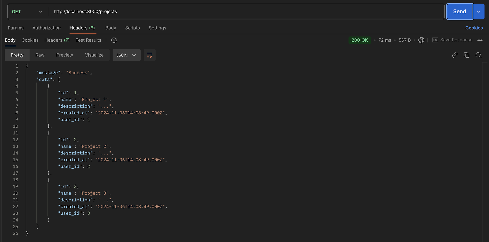

# Тестування працездатності системи

Для тестування використано Postman

### Запуск сервера

    

### GET /projects

    

### GET /projects/:id

    

### POST /projects 

    

    

### PUT /projects/:id

    

    

### DELETE /projects/:id

    

    

### POST without fields

    

### GET with wrong id

    

### PUT without fields

    

### PUT with wrong id

    

### DELETE with wrong id

    

